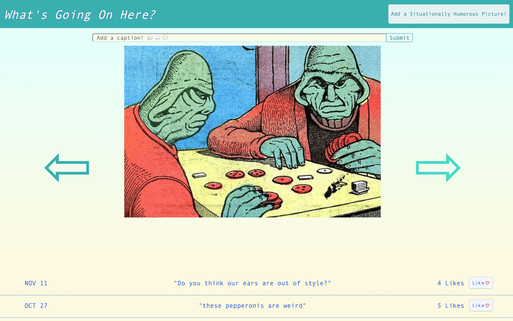
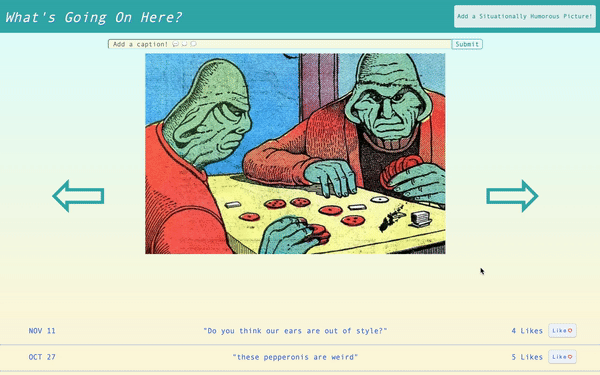
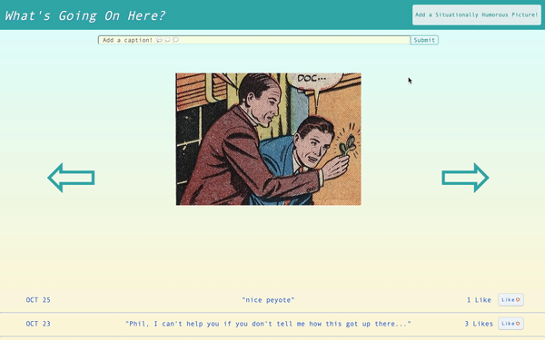
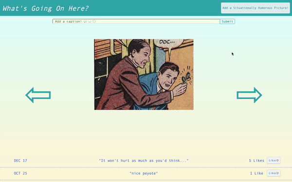
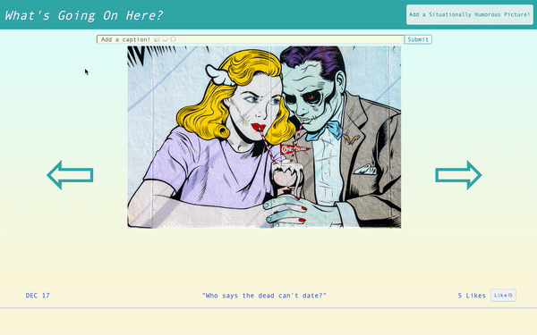

Casual app for browsing or submitting images and adding humorous captions. It is a project 
application done for module 3 of Flatiron School. Besides smoothing up existing features, 
refactoring certain code blocks, and seeking out bugs, the main to-dos are:
  - add custom validation error messages
  - enable caption box scrolling from anywhere in window
  - create thumbnail view of images (stretch goal)
  - enable drag-and-drop image uploading (stretch goal)

## Author
  - Dan Romans | [dangrammer](https://github.com/dangrammer)

## Frontend Repository
  - [What's Going On Here? Client](https://github.com/dangrammer/whats-going-on-here-frontend)

## Ruby Version
  - ruby 2.6.1

## Rails Version
  - rails 6.0.3.1

## Database
  - postgreSQL 1.2.3

## Gem Dependencies
  - active_model_serializers 0.10.10
  - rack-cors 1.1.1
  
## Live Demo
  Link to walkthrough video with narration:
   
    

## Screenshots

  Flip Through Image Gallery
   
  

  Scroll Through Captions and _Like_ Feature
   
  

  Add Caption
   
  

  Add Image
   
  

  Hidden Link To Author Site
   
  

## How To Install and Run

1. fork (optional) then clone or download this repository to local machine
2. use text editor and/or terminal to navigate into `topical-backend` directory
3. run `bundle install` (or `bundle i`) in terminal to install necessary dependencies
4. run `rails db:create` in terminal to create database
5. run `rails db:migrate` in terminal to initialize database
6. run `rails db:seed` in terminal to seed database with starter data
7. run `rails s` in terminal to run server in browser at http://localhost:3000/
8. install and run [What's Going On Here? frontend](https://github.com/dangrammer/whats-going-on-here-frontend)
